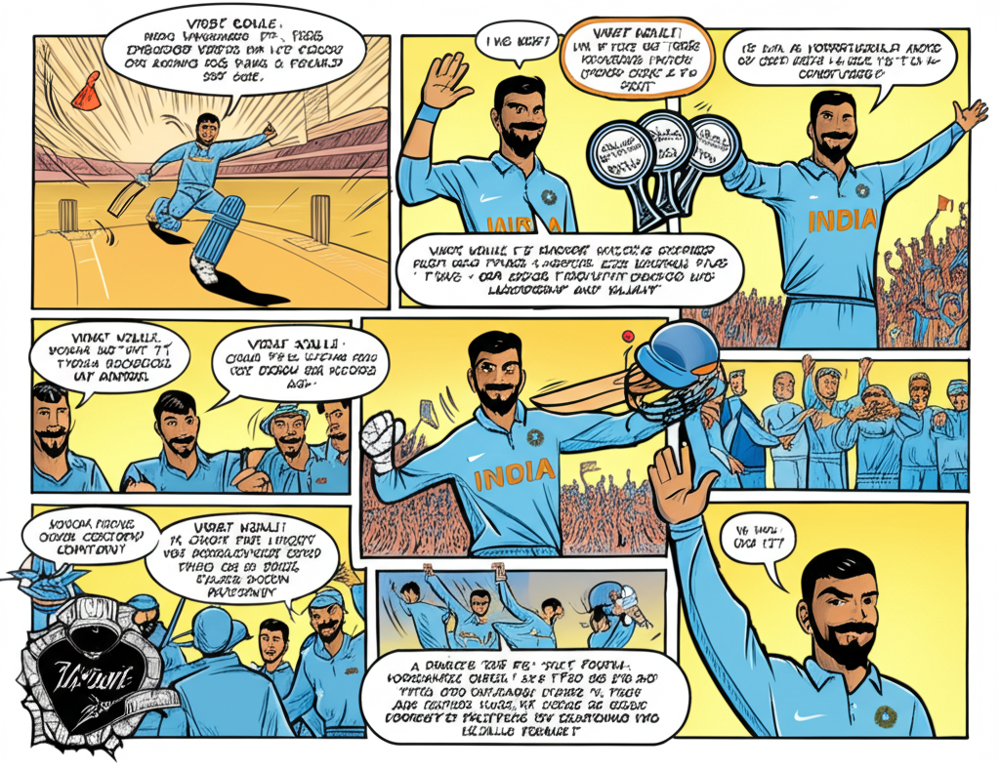

# wiki-to-comic
Made this for a hackathon
Takes in wikipedia url as input and outputs a comic using Gemini image generation. Two art styles available (manga and comic) along with complexity level (1 for easiest, 2 for normal and 3 for hardest/complex writing).

## How to use
1. Put in your Gemini API key into 01.py and 02.py
2. Run 01.py with arguments in the form of '01.py <Wikipedia URL> <Art Style> <Complexity Level>' which will generate files comic_manuscript.txt and comic_metadata.txt. Artstyle can be 'manga' for manga style and 'western' for western comic style. Complexity level is ranging from 1-3.
3. Then run 02.py. This will generate a comic comic_page.png.

## Models used
1. For comic manuscript (text to text): gemini-1.5-pro-latest
2. For comic page (text to image): gemini-2.0-flash-exp-image-generation

## Example
```
python 01.py https://en.wikipedia.org/wiki/Virat_Kohli western 3
python 02.py
```

## Generated Image

